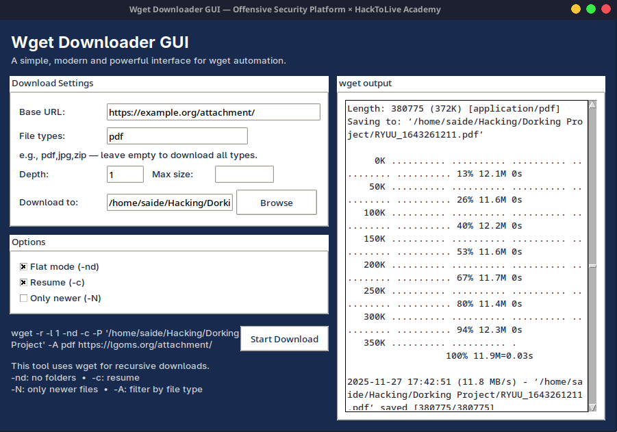

# Wget Downloader GUI

Simple graphical interface for `wget` with filtering, recursion control, and real-time logs. ```https://github.com/offsecplatform/wget-downloader-gui```

---




---


## Features

* GUI wrapper for wget
* Recursive downloading with depth control
* File-type filtering (pdf, jpg, zip, etc.)
* Resume downloads & only-newer mode
* Max file-size limit
* Flat directory mode
* Live wget log output
* Command preview
* Threaded execution (UI stays responsive)

---

## Requirements

* Python 3.8+
* Tkinter
* wget installed on system PATH

---

## Usage

1. Enter base URL
2. Set file types, depth, size limits
3. Choose download folder
4. Enable desired options
5. Click **Start Download**

---

## Run

```bash
python wget_gui.py
```

---

## Credits

[Offensive Security Platform](https://offsecplatform.com) × [HackToLive Academy](https://hacktolive.net/)


